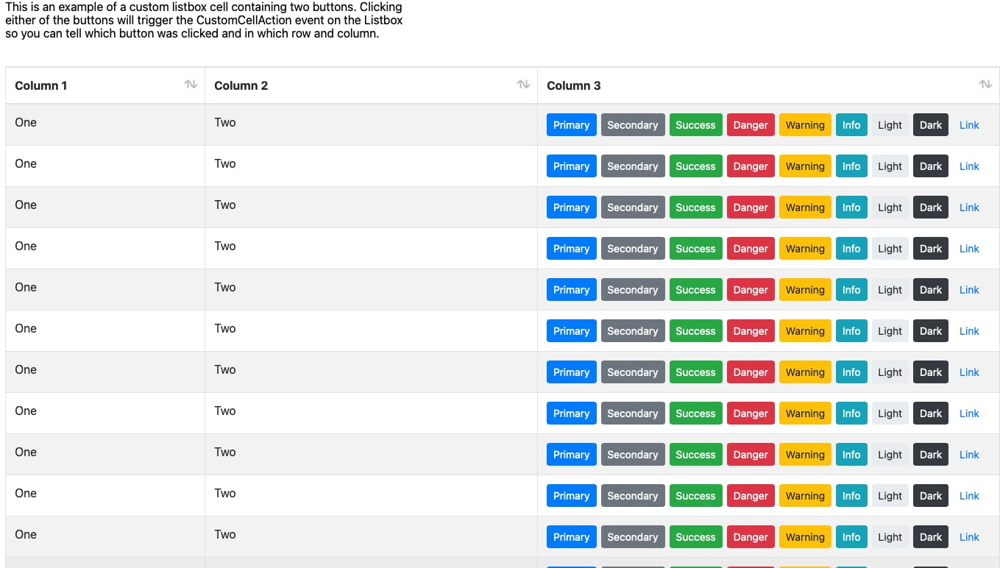

# Xojo-WebListBoxCellRenderers
Custom CellRenderers for Xojo Weblistboxes (Web 2.0 Framework)

This repo is here to add some functionality to CellRenderers for Xojo WebListboxes

First release is to add Buttons to WebListBoxes with Caption, Tag and configurable ButtonStyle (color)

# Usage

Just copy the classes ButtonColumn and WebListBoxButton to your project

## Assign button to a cell:
`WebListbox.CellValueAt(row,column) = New ButtonColumn(New WebListBoxButton("Caption", "tag", WebUIControl.Indicators.Primary))`

## or add multiple buttons:
`Me.CellValueAt(row,2) = New ButtonColumn(New WebListBoxButton("Primary", "primary", WebUIControl.Indicators.Primary), _
New WebListBoxButton("Secondary", "secondary", WebUIControl.Indicators.Secondary), _
New WebListBoxButton("Success", "success", WebUIControl.Indicators.Success), _
New WebListBoxButton("Danger", "danger", WebUIControl.Indicators.Danger), _
New WebListBoxButton("Warning", "warning", WebUIControl.Indicators.Warning), _
New WebListBoxButton("Info", "info", WebUIControl.Indicators.Info), _
New WebListBoxButton("Light", "light", WebUIControl.Indicators.Light), _
New WebListBoxButton("Dark", "dark", WebUIControl.Indicators.Dark), _
New WebListBoxButton("Link", "link", WebUIControl.Indicators.Link))`

